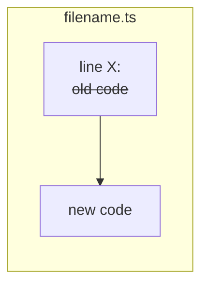
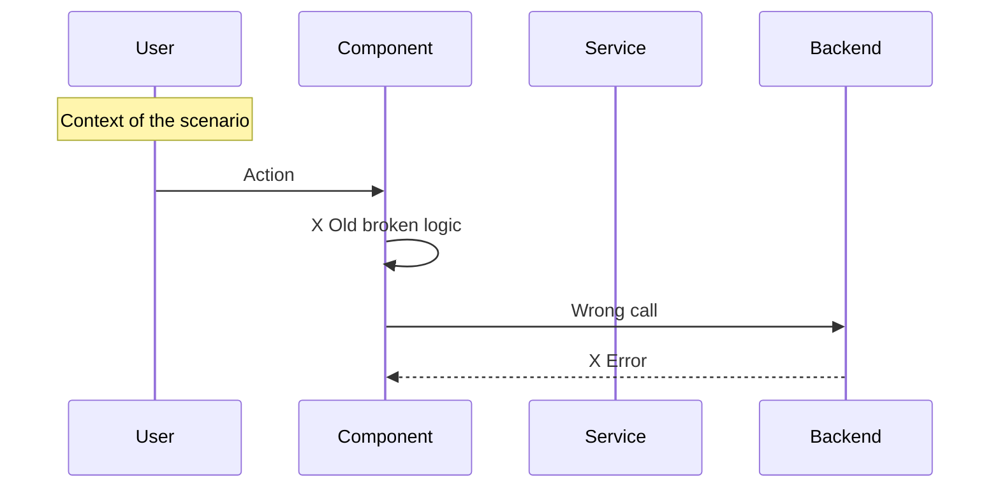
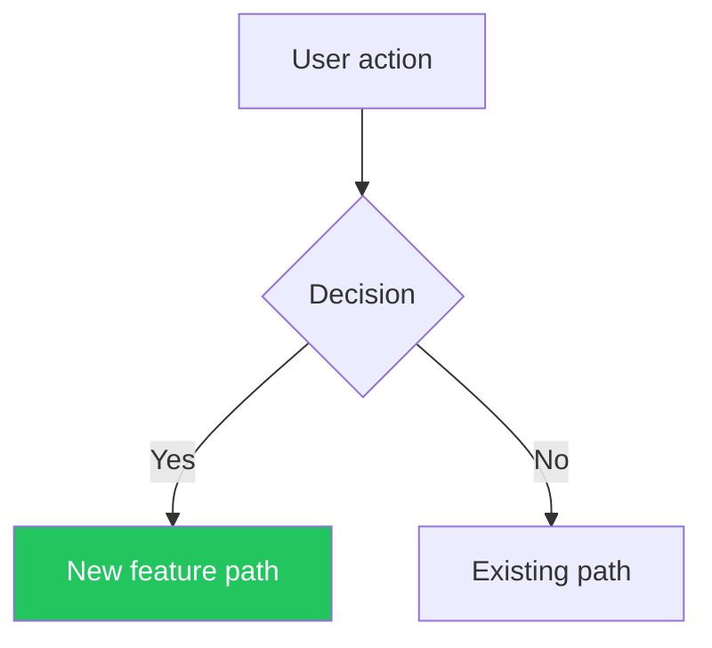
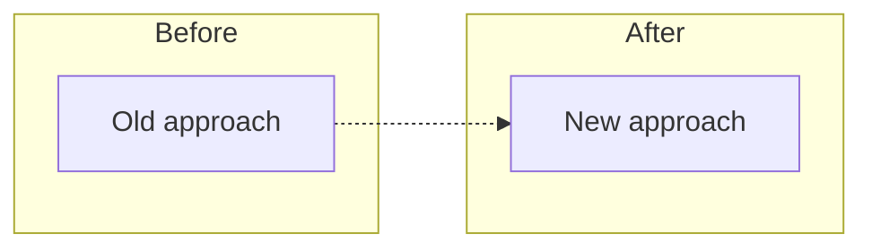
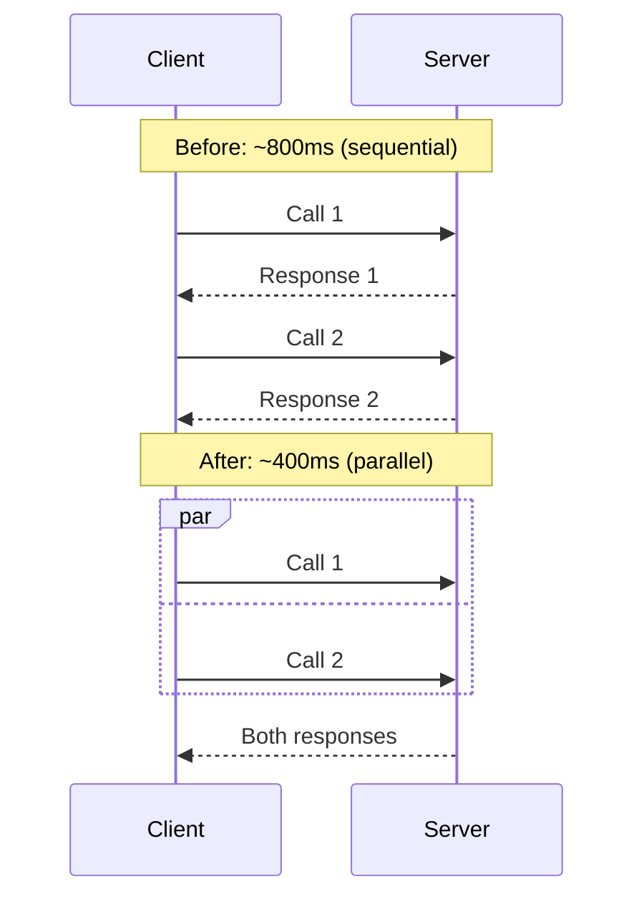
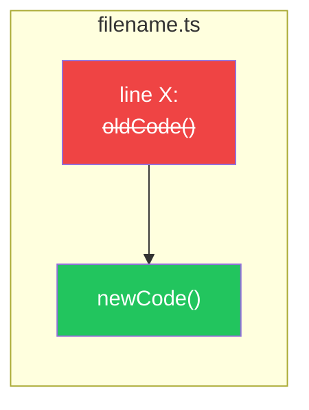

# PR Description Generator

When creating or updating a pull request, ALWAYS generate a comprehensive, visual description following the format below. The goal is that a reviewer can understand the entire PR in under 60 seconds by scanning diagrams and bold titles.

## Process

1. **Identify the base branch** (usually `master` or `main`)
2. **Read ALL commits** in the branch: `git log --oneline <base>..HEAD`
3. **Read the full diff** against base: `git diff <base>...HEAD --stat` for an overview
4. **Read the actual code changes** for key files: `git diff <base>...HEAD -- <file>` to understand the logic
5. **Categorize changes** into: Features, Bug Fixes, Performance, UI/UX, Refactoring, Testing, Documentation
6. **Create Mermaid diagrams** to visualize the changes (see Diagram Guidelines below)
7. **Write the description in English** regardless of the conversation language

## PR Description Template

```markdown
## Summary

[1-3 bullet points explaining WHAT changed and WHY, in plain language]

## Diagrams

### [Diagram title - e.g., "Data Flow", "Bug -> Fix", "Architecture Change"]

```mermaid
[Appropriate diagram type - see Diagram Guidelines]
```

### [Additional diagram if needed - e.g., "Code Changes", "State Machine"]

```mermaid
[Additional diagram]
```

## Changes

### [Category 1] (e.g., Features, Bug Fixes, Performance)
- **[Change title]** - brief explanation of what and why
- **[Change title]** - brief explanation of what and why

### [Category 2]
- ...

## Code Changes (key files)



## Test Plan

- [x] [Automated test that passes - with count if applicable]
- [x] [Another automated test]
- [ ] [Manual test step to verify]
- [ ] [Another manual verification]

### What type of PR is this?

- [ ] Refactor
- [ ] Feature
- [ ] Bug Fix
- [ ] Optimization
- [ ] Documentation Update
- [ ] Testing Coverage
- [ ] Other
```

## Diagram Guidelines

ALWAYS include at least one Mermaid diagram. Choose the most appropriate type:

### For Bug Fixes -> Sequence Diagram (Before/After)
Show the broken flow AND the fixed flow side by side:



Then a second diagram showing the fix with checkmark markers.

### For Features -> Flowchart or Sequence Diagram
Show the new data flow or user journey:



### For Refactoring -> Flowchart with Before/After subgraphs


### For Performance -> Sequence Diagram with timing


### For Code Changes -> Flowchart with strikethrough
Show the key code changes visually:



## Color Conventions for Diagrams

Use consistent colors across all diagrams:
- `#22c55e` (green) -> Correct/Fixed/New/Success
- `#ef4444` (red) -> Broken/Removed/Error
- `#f59e0b` (amber) -> Warning/Fallback/Changed
- `#3b82f6` (blue) -> Info/Alternative path
- `#6366f1` (indigo) -> Default/Neutral state

## Rules

1. **Language**: Always write in English regardless of conversation language
2. **Diagrams are mandatory**: Every PR MUST have at least one Mermaid diagram
3. **Be specific**: Don't say "various improvements" - list each change
4. **Group logically**: Group related changes under clear category headers
5. **Lead with impact**: Start each bullet with **bold title** describing the user/developer impact
6. **Keep it scannable**: Reviewers should understand the PR in 30 seconds by reading bold titles and diagrams only
7. **Test plan with checkboxes**: Always include a test plan with `[x]` for automated and `[ ]` for manual tests
8. **Include test counts**: If tests exist, show counts (e.g., "115/115 tests pass")
9. **Don't include formatting-only changes**: Skip whitespace/quote reformatting
10. **Check the PR type boxes**: Mark the appropriate checkboxes
11. **Remove template boilerplate**: Delete any default PR template instructions
12. **Link Linear issues**: If there are associated Linear issues, link them at the bottom

## Diagram Decision Tree

```
Is it a bug fix?
  -> YES: Two sequence diagrams (Bug + Fix) + resolution flowchart
  -> NO: Is it a feature?
    -> YES: Flowchart showing new data/user flow
    -> NO: Is it performance?
      -> YES: Sequence diagram with timing comparison
      -> NO: Is it refactoring?
        -> YES: Before/After flowchart
        -> NO: At minimum, a code changes flowchart
```

## Anti-patterns

- Don't skip diagrams - they are the most valuable part of the PR description
- Don't copy-paste commit messages verbatim - synthesize and group them
- Don't include internal implementation details that don't matter to reviewers
- Don't leave the default PR template unfilled
- Don't create overly complex diagrams - keep them focused on the key change
- Don't use more than 3 diagrams unless the PR is very complex
