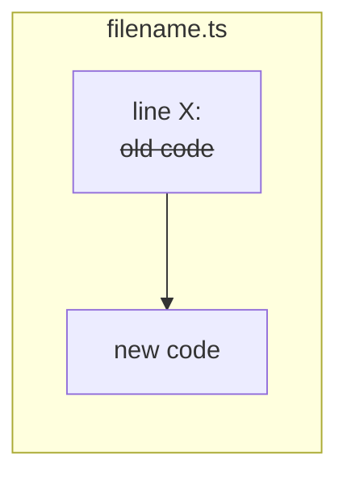
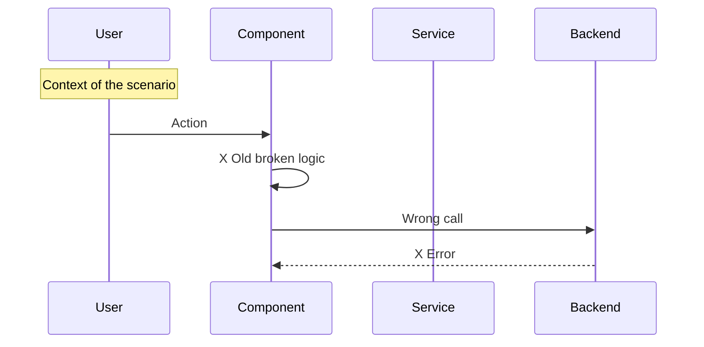
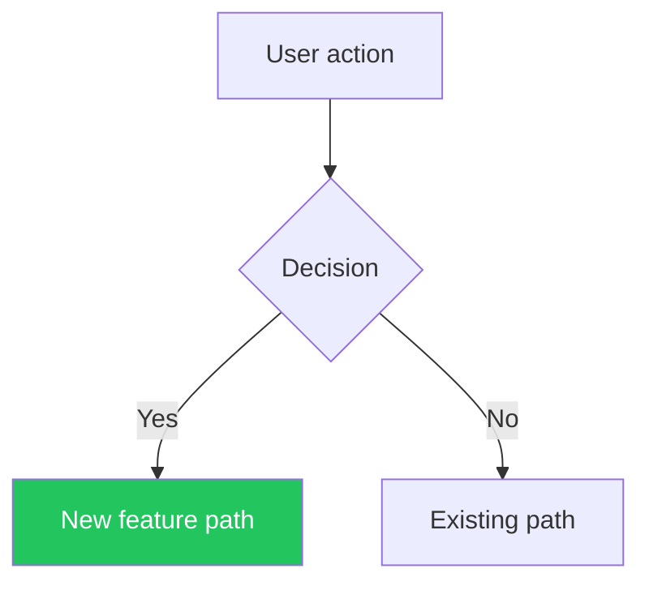
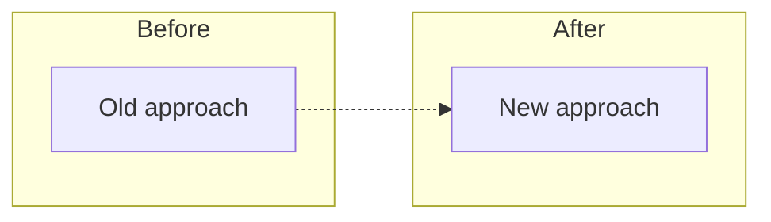
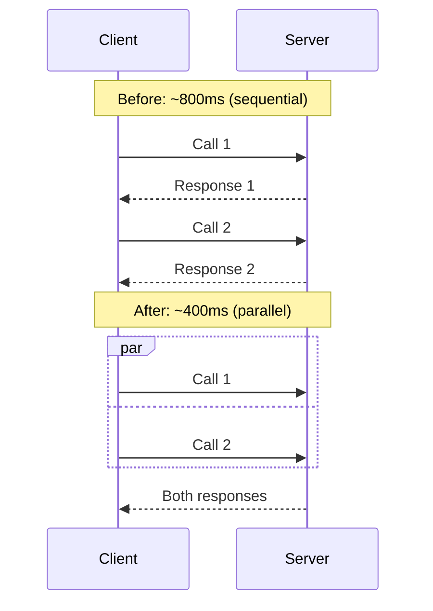
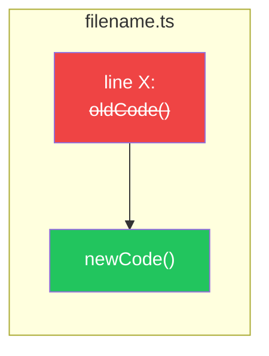

# PR Description Generator

When creating or updating a pull request, ALWAYS generate a comprehensive, visual description following the format below. The goal is that a reviewer can understand the entire PR in under 60 seconds by scanning diagrams and bold titles.

## Process

1. **Identify the base branch** (usually `master` or `main`)
2. **Read ALL commits** in the branch: `git log --oneline <base>..HEAD`
3. **Read the full diff** against base: `git diff <base>...HEAD --stat` for an overview
4. **Read the actual code changes** for key files: `git diff <base>...HEAD -- <file>` to understand the logic
5. **Categorize changes** into: Features, Bug Fixes, Performance, UI/UX, Refactoring, Testing, Documentation
6. **Create Mermaid diagrams** to visualize the changes (see Diagram Guidelines below)
7. **Write the description in English** regardless of the conversation language

## PR Description Template

````markdown
## Summary

[1-3 bullet points explaining WHAT changed and WHY, in plain language]

## Diagrams

### [Diagram title - e.g., "Data Flow", "Bug -> Fix", "Architecture Change"]

```mermaid
[Appropriate diagram type - see Diagram Guidelines]
```

### [Additional diagram if needed - e.g., "Code Changes", "State Machine"]

```mermaid
[Additional diagram]
```

## Changes

### [Category 1] (e.g., Features, Bug Fixes, Performance)
- **[Change title]** - brief explanation of what and why
- **[Change title]** - brief explanation of what and why

### [Category 2]
- ...

## Code Changes (key files)


```mermaid
flowchart LR
    subgraph "filename.ts"
        A["line X:<br/><s>old code</s>"] --> B["new code"]
    end
```

## Test Plan

- [x] [Automated test that passes - with count if applicable]
- [x] [Another automated test]
- [ ] [Manual test step to verify]
- [ ] [Another manual verification]

### What type of PR is this?

- [ ] Refactor
- [ ] Feature
- [ ] Bug Fix
- [ ] Optimization
- [ ] Documentation Update
- [ ] Testing Coverage
- [ ] Other

## Evidence (Before/After)

<!-- Backend / API / service — run locally, exercise with real requests, capture stdout/responses, render to PNG: -->


<!-- UI — run the app locally, drive the real screen with Playwright, screenshot actual rendered UI: -->
| Before | After |
|--------|-------|
|  |  |

<!-- New component — no prior screen exists, after-only: -->


<!-- CLI / hooks / scripts — run the real command, capture real output, screenshot it: -->


<!-- Fallback only when the service genuinely cannot be run locally (hard external deps, secrets): capture from a real deployed run or emit an explicit placeholder for the author — NEVER invent or mock the image: -->
| Before | After |
|--------|-------|
| _[author: attach REAL BEFORE screenshot here — no mocks]_ | _[author: attach REAL AFTER screenshot here — no mocks]_ |
````

## Evidence Contract

Every evidence artifact follows three provider-agnostic steps: **Capture → Upload → Embed**. The key constraint: **Capture MUST derive from a genuine run of the real system**. Fabricated, illustrated, or mocked output is a defect.

### Capture (mandatory — real run only)

The evidence image MUST be derived from the change actually working:

1. Run the service/app locally on the PR branch (install deps in a venv/virtualenv; stub only unavoidable external calls like downstream microservices that require secrets or live infra; disable tracing/telemetry).
2. Exercise the feature for real — send real requests / drive the real UI. Include a positive case AND a negative/contrast case where it makes sense.
3. Capture the REAL output to files: server stdout/logs, real HTTP responses, real command output.
4. Render that captured output into a PNG — read the real output files and inject their verbatim content (e.g. via a Playwright screenshot of a styled HTML page built from the captured text). The image text is COPIED from the captured files, not authored by the agent.

If the service genuinely cannot be run locally (hard external deps, unavailable secrets), fall back to capturing from a real deployed run (e.g. real logs from an observability platform). Last resort only: emit an explicitly-labeled author-screenshot placeholder — never invent the picture.

### Upload (GitHub draft-release asset)

Push the PNG as a release asset on a persistent draft release named `pr-evidence`. Asset names MUST be unique per PR (e.g. `pr-{N}-evidence.png`).

```
# Ensure the draft release exists (create once, reuse forever)
gh release view pr-evidence --repo {owner}/{repo} >/dev/null 2>&1 || \
  gh release create pr-evidence --repo {owner}/{repo} --draft \
    --title "PR Evidence (automated)" \
    --notes "Hidden reusable container for automated PR evidence screenshots."

# Upload (--clobber replaces if already exists)
gh release upload pr-evidence ./pr-{N}-evidence.png --repo {owner}/{repo} --clobber

# Retrieve the asset URL
URL=$(gh release view pr-evidence --repo {owner}/{repo} \
  --json assets --jq '.assets[]|select(.name=="pr-{N}-evidence.png")|.url')
```

**Private-repo note**: an anonymous `curl` of the asset URL returns 404 — do not interpret this as a broken upload. The asset renders correctly for any logged-in reviewer with repo access (served same-origin, not via the camo proxy). This hosting approach lives entirely outside the git tree: no branches, no blobs in history, no tag (a draft release carries no tag).

### Embed

Post the image as a PR comment and/or include it in the description:

```
gh pr comment {N} --repo {owner}/{repo} --body ""
```

### Provider resolution order (pick the first available)

1. **Automated real-run capture** — run the service locally, exercise it, capture real output, render to PNG, upload as a release asset, embed. This is the default and expected path.
2. **Generic Playwright capture** — for UI changes: run the app locally, drive the real screen with Playwright, screenshot the actual rendered UI (before/after), upload as release assets, embed.
3. **Real deployed-run capture** — if local run is impossible: capture genuine output from a real deployed run (logs, traces from an observability platform). Upload and embed as above.
4. **Author-screenshot placeholder** — absolute last resort only when no real-run output is reachable: emit an explicit, clearly-labeled placeholder instructing the author to attach a REAL screenshot. The placeholder must make it unmistakable that a mock or invention is not acceptable. This is the ONLY non-automated fallback — it is never pasted terminal text.

## Evidence Routing

Reuse the same diff categorization used for diagram selection to pick the capture path. Every branch MUST terminate in an embedded `` derived from real captured output — text, fenced code blocks, and test runs are not evidence.

```
Categorize diff ->
  backend / API / service? -> run locally (venv, stub only unavoidable external deps)
                              -> exercise with real requests (positive + contrast case)
                              -> capture stdout/logs + HTTP responses to files
                              -> render verbatim captured content to PNG via Playwright
                              -> upload as pr-evidence release asset -> embed
  UI?                      -> run app locally
                              -> drive real screen with Playwright -> screenshot actual UI
                              -> before + after PNGs -> upload as release assets
                              -> embed in Before|After table
                              (new component -> after-only, no empty Before cell)
  CLI / hooks / scripts?   -> run real command -> capture real output to file
                              -> render captured output to PNG -> upload -> embed
  everything else          -> image of end-to-end flow actually running
  (refactor, docs, config)    -> follow closest branch above for the dominant artifact type

ALL branches MUST end in  showing the real system running.
A text/code-block artifact, a mocked card, a fabricated screenshot, or an illustration is a DEFECT.
```

**Validated hosting**: the draft-release asset approach above has been validated end-to-end on a private repo — the image renders inline in a PR comment for a logged-in reviewer. Use it for all change types.

## Diagram Guidelines

ALWAYS include at least one Mermaid diagram. Choose the most appropriate type:

### For Bug Fixes -> Sequence Diagram (Before/After)
Show the broken flow AND the fixed flow side by side:


```mermaid
sequenceDiagram
    participant User
    participant Component
    participant Service
    participant Backend

    Note over User: Context of the scenario

    User->>Component: Action
    Component->>Component: X Old broken logic
    Component->>Backend: Wrong call
    Backend-->>Component: X Error
```

Then a second diagram showing the fix with checkmark markers.

### For Features -> Flowchart or Sequence Diagram
Show the new data flow or user journey:


```mermaid
flowchart TD
    A[User action] --> B{Decision}
    B -->|Yes| C[New feature path]
    B -->|No| D[Existing path]
    style C fill:#22c55e,color:#fff
```

### For Refactoring -> Flowchart with Before/After subgraphs

```mermaid
flowchart LR
    subgraph Before
        A[Old approach]
    end
    subgraph After
        B[New approach]
    end
    A -.-> B
```

### For Performance -> Sequence Diagram with timing

```mermaid
sequenceDiagram
    Note over Client,Server: Before: ~800ms (sequential)
    Client->>Server: Call 1
    Server-->>Client: Response 1
    Client->>Server: Call 2
    Server-->>Client: Response 2

    Note over Client,Server: After: ~400ms (parallel)
    par
        Client->>Server: Call 1
    and
        Client->>Server: Call 2
    end
    Server-->>Client: Both responses
```

### For Code Changes -> Flowchart with strikethrough
Show the key code changes visually:


```mermaid
flowchart LR
    subgraph "filename.ts"
        A["line X:<br/><s>oldCode()</s>"] --> B["newCode()"]
    end
    style A fill:#ef4444,color:#fff
    style B fill:#22c55e,color:#fff
```

## Color Conventions for Diagrams

Use consistent colors across all diagrams:
- `#22c55e` (green) -> Correct/Fixed/New/Success
- `#ef4444` (red) -> Broken/Removed/Error
- `#f59e0b` (amber) -> Warning/Fallback/Changed
- `#3b82f6` (blue) -> Info/Alternative path
- `#6366f1` (indigo) -> Default/Neutral state

## Rules

1. **Language**: Always write in English regardless of conversation language
2. **Diagrams are mandatory**: Every PR MUST have at least one Mermaid diagram
3. **Be specific**: Don't say "various improvements" - list each change
4. **Group logically**: Group related changes under clear category headers
5. **Lead with impact**: Start each bullet with **bold title** describing the user/developer impact
6. **Keep it scannable**: Reviewers should understand the PR in 30 seconds by reading bold titles and diagrams only
7. **Test plan with checkboxes**: Always include a test plan with `[x]` for automated and `[ ]` for manual tests
8. **Include test counts**: If tests exist, show counts (e.g., "115/115 tests pass")
9. **Don't include formatting-only changes**: Skip whitespace/quote reformatting
10. **Check the PR type boxes**: Mark the appropriate checkboxes
11. **Remove template boilerplate**: Delete any default PR template instructions
12. **Link Linear issues**: If there are associated Linear issues, link them at the bottom
13. **Evidence is always a real-run embedded image**: Evidence MUST be a real embedded image `` derived from genuine captured output of the change actually working — for EVERY PR type (backend, UI, refactor, docs, CLI, hooks). Fabricating, illustrating, or mocking evidence is a defect. Pasted terminal text, `<pre>` blocks, and fenced code blocks are NOT acceptable evidence. The only permitted fallback is an explicit author-screenshot placeholder (for genuinely unrunnable services) that itself resolves to an embedded image once filled with a REAL screenshot.

## Diagram Decision Tree

```
Is it a bug fix?
  -> YES: Two sequence diagrams (Bug + Fix) + resolution flowchart
  -> NO: Is it a feature?
    -> YES: Flowchart showing new data/user flow
    -> NO: Is it performance?
      -> YES: Sequence diagram with timing comparison
      -> NO: Is it refactoring?
        -> YES: Before/After flowchart
        -> NO: At minimum, a code changes flowchart
```

## Mermaid Syntax — GitHub Compatibility

GitHub's Mermaid renderer is strict. Follow these rules to avoid parse errors:

1. **Subgraph IDs must not start with or be bare numbers.** Use `subgraph MyId["Label 012"]` instead of `subgraph Label 012`
2. **Node IDs must be alphanumeric identifiers** (no spaces, no leading digits). Put display text in `["..."]`
3. **Avoid special characters in bare labels**: parentheses, colons, pipes, ampersands, and quotes must be inside `["..."]`
4. **Link labels** use `-->|"label text"| B` — quote the label if it contains spaces or special chars
5. **Keep diagrams simple**: max ~15 nodes per diagram. Split into multiple diagrams if needed
6. **Always test mentally**: if an ID or label contains numbers, spaces, or symbols, wrap it in `["..."]`

### Common mistakes → fixes

| Broken | Fixed |
|--------|-------|
| `subgraph Migration 012` | `subgraph Mig012["Migration 012"]` |
| `A -->\|schema\| Migration 012` | `A -.->\|schema\| Mig012` |
| `Node (optional)` | `Node["Node (optional)"]` |
| `DB: PostgreSQL` | `DB["DB: PostgreSQL"]` |

## Anti-patterns

- Don't skip diagrams - they are the most valuable part of the PR description
- Don't copy-paste commit messages verbatim - synthesize and group them
- Don't include internal implementation details that don't matter to reviewers
- Don't leave the default PR template unfilled
- Don't create overly complex diagrams - keep them focused on the key change
- Don't use more than 3 diagrams unless the PR is very complex
- Don't present pasted terminal output, logs, or a test run (even red → green) as evidence — evidence is an image of the real thing working, embedded as ``.
- Don't fabricate, illustrate, or mock the evidence image — the image content must be copied verbatim from actual captured output (files written during a real local or deployed run).
- Don't use branch-based raw.githubusercontent.com URLs for evidence — use draft-release asset URLs via `gh release upload` (validated to render on private repos).
- Don't auto-checkout the base branch to capture UI before-state — drive the real app locally with Playwright for before/after screenshots.
- Don't skip the real run because the service "seems simple" — even a trivial handler must be exercised for real before claiming it works.
